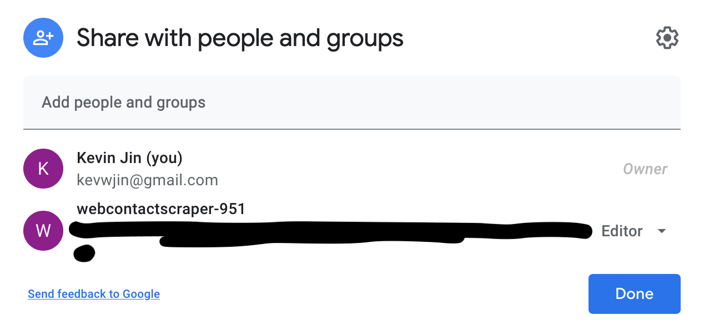
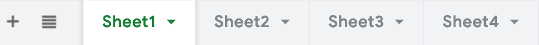
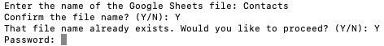
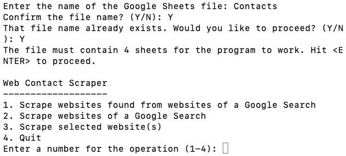
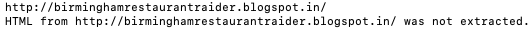
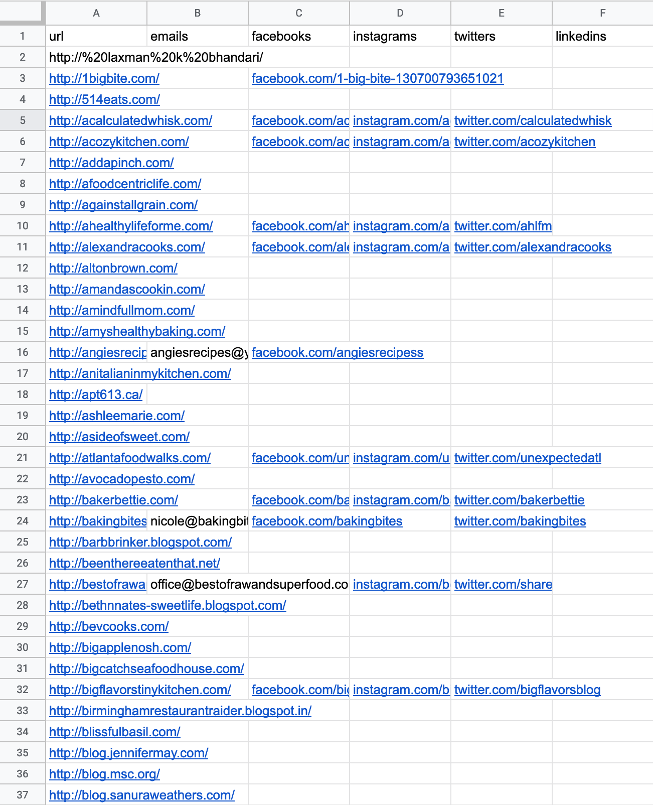

## Description

While manual input of keywords into a search engine is efficient for varied searches, the method is less suitable when the searches are repetitive; instead, web scraping, or the automation of data extraction from a website, is the most convenient method.

**Contacts Web Scraper** is built to scrape websites with an *About*, *Contact*, or *Our Team* page that lists email and SNS contact information. Blogs, for instance, are a category of websites that commonly have the aforementioned types of pages.

**Contacts Web Scraper** allows the you to:
1. scrape contacts from websites from websites retrieved from a Google search page
    - e.g. Let the search phrase of the Google search page be *top 100 fitness blogs*. If the search page contains websites with a list of 100 URLs to fitness blogs, then the scraper will scrape each of the websites from the search page for the URLs and scrape each of the websites from the URLs for contacts. The scraper removes duplicate websites automatically.
2. scrape contacts from websites of a Google search page
3. scrape contacts from websites

All the contact information is filed into your *manually* created Google Sheet file, which must contain at least 4 sheets and be shared with a service account with the following email: *email kevwjin@gmail.com for the service account email and the credentials.json file*. The first sheet is to display the scraped contacts, while the next sheets are for input of operations 1, 2, and 3 respectively (listed above).

## Getting Started

In order to run the program, you must have ‘python3’ installed. After downloading all the program files, navigate to the *WebContactSheetManager.py* file through terminal:

**Introductory Terminal Guide**

‘cd’ by itself is used to navigate to the root directory. For Unix (MacOS, Linux, etc.), ‘ls’ displays the current directory’s contents; use ‘ls’ as a way to view which directories can be navigated to from the current directory. In Windows, the terminal uses ‘dir’ instead. ‘cd Documents’ navigates to the *Documents* directory. When arriving in a directory with the *WebContactSheetManager.py* file, run the script with the command ‘python3 WebContactSheetManager.py’. In order to stop and exit the program, hit ‘Ctrl + C’ in the terminal.

When running the program, the first notice instructs to share the Google Sheets file to the service account email. In your Google Drive, create a new sheet, and add sheets to the file so that there are a total of at least 4 sheets. Once the Google Sheets file is shared with the service account email, enter the name of the Google Sheets file. The name needs to be unique from the names of other Google Sheets; otherwise the program will not create a new sheet. If the sheet you want to access has already been created, confirm that you would like to proceed. Depending on whether you are creating a new sheet, the program will either prompt you to enter the password or prompt you to create a new password.

The program will then prompt a warning that “the file must contain 4 sheets for the program to work.” If your file indeed has 4 sheets, hit ‘Enter’ to proceed. The wait to connect to and set up the Google Sheets file may take a few seconds.

A menu with the scraping operations will soon appear, and you may proceed to your desired scrape. At the same time, open your Google Sheets file. The program inserted headers in the first row of every sheet during the set up.

## Operations

***Note that for operations 1 and 2, Google does not permit scraping their search results in their Terms of Service, but if you scrape at a rate of less than 6 unique keyphrases per hour, you will not be detected according to this stackoverflow.***

For the first operation, insert the keyphrase in the first column of the second sheet of your file. You must insert the keyphrases in order, such that there is no empty cell between keyphrases in the column. Once you confirm the operation, the program will begin scraping, and update the status of your inputs to “to scrape” in the spreadsheet.

Occasionally, you may spot a message stating that the “HTML from [website url] was not extracted.” The program will simply ignore the current website and move onto the next website to scrape.

The same process applies to operation 2 and 3. Both operations will append the extracted contact information to the first sheet. Here is an example output.

